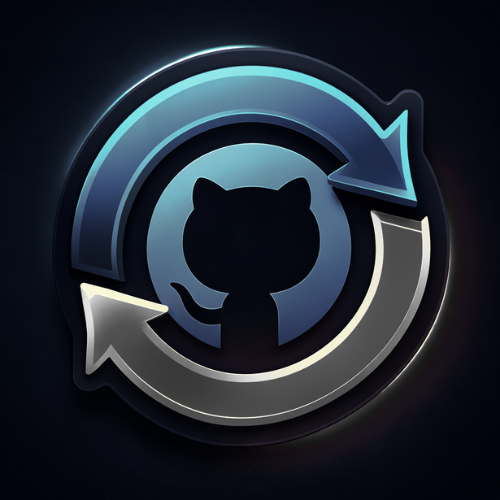

<p align="center">
  
</p>

<h1 align="center">GitSync</h1>

<p align="center">
  <strong>Effortlessly sync your local workspace folders directly with GitHub.</strong>
</p>

<p align="center">
  
  
  
</p>

## ✨ Features

- **🚀 Automated Background Synchronization:** Watch your directories and auto-sync to GitHub effortlessly.
- **🖼️ Beautiful Web UI Dashboard:** Manage your repositories, workspaces, and watch configurations through a clean, modern interface.
- **🤖 AI-Generated Commits & READMEs:** Automatically generate meaningful commit messages and default `README.md` files utilizing OpenAI or Google Gemini.
- **📁 Native File Picker Integration:** Smoothly select folders from your OS with deeply integrated Windows UI dialogs.
- **🔒 Single-Instance Execution:** Safely guarantees only one instance of GitSync runs at any given time.

---

## 📥 Download & Installation

The easiest way to use GitSync is by downloading the pre-packaged executable. You do not need Python installed to run the `.exe`.

1. Go to the [Releases Page](https://github.com/MrShadowRIFAT/GitSync/releases).
2. Download the latest `GitSync.exe`.
3. Double-click the downloaded executable to start the background agent. The dashboard will automatically open in your default browser.

---

## 🛠️ Requirements

If you are running the `GitSync.exe` directly, you only need:
- **[Git](https://git-scm.com/downloads)** installed on your system.
- A **GitHub Personal Access Token (PAT)** (configured within the GitSync dashboard settings) for API access.
- *(Optional)* An OpenAI or Google Gemini API Key for AI generation features.

### For Developers

If you want to run the project from the source code, please ensure you have the following installed:
- Python 3.8+
- Requirements located in `requirements.txt`

```bash
git clone https://github.com/MrShadowRIFAT/GitSync.git
cd GitSync
pip install -r requirements.txt
python main.py
```

## 🏗️ Building the Executable

To bundle the application yourself, you can use the provided build script:

```bash
.\build.bat
```

This leverages PyInstaller to package the FastApi backend, HTML dashboard, and Python dependencies into a single, portable executable found inside the `dist/` directory.

## 🤝 Support & Feedback

If you enjoy using GitSync, please consider giving this repository a ⭐ **Star**! It helps others discover the project.

Encountered a bug or have a feature request? Please [open an issue](https://github.com/MrShadowRIFAT/GitSync/issues) on GitHub.

## 📄 License
MIT License
